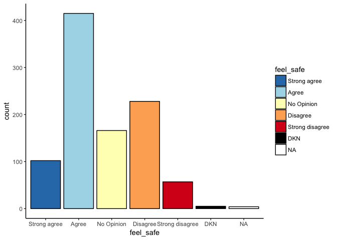

# Smart Cities YYT Baseline Survey Results

Results are from 977 participants who completed the online survey. Once complete we will post the analysis of the final results. We will flag invalid results or changes in sample size below each figure or description. 


#### Question 1

##I can easily get around St. John's


```r
plot(q1_plot)
```

<!-- -->

#### Question 2

##I feel safe while getting around in St. John's


```r
plot(q2_plot)
```

<!-- -->

