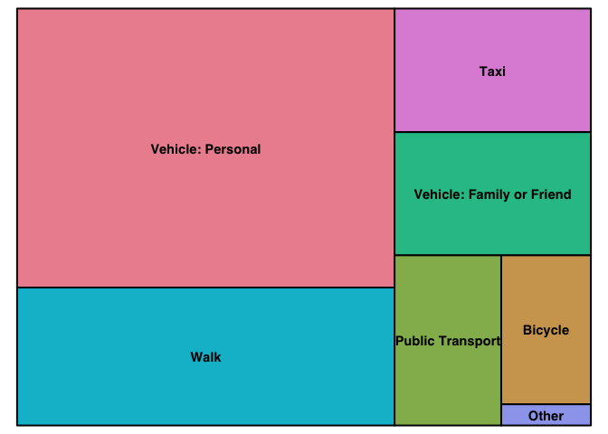

# Smart Cities YYT Baseline Survey Results

Results are from 977 participants who completed the online survey. Once complete we will post the analysis of the final results. We will flag invalid results or changes in sample size below each figure or description. 


#### Question 1

## I can easily get around St. John's  


```r
plot(q1_plot)
```

<!-- -->

**Figure 1. Histogram of respones to how easily people can get around St. John's.**

There are distinct differences between whether people feel they can easily get around St. John's. While the majority of people feel they can easily get around St. John's, there is a large number of people who disagree or strongly disagree and feel they cannot easily get around St. John's. 

#### Question 2

## I feel safe while getting around in St. John's


```r
plot(q2_plot)
```

<!-- -->

**Figure 2. Histogram of respones to how safe people feel getting around St. John's.**

The majority of people feel that they can safely get around St. John's. Nearly 300 people of the 974 who answered the question disagree and do not feel safe getting around St. John's. 

#### Question 3

## I can use my preferred mode of transportation (for example car, bus, human-powered transportation or other) in St. John’s


```r
plot(q3_plot)
```

<!-- -->

**Figure 3. Histogram of respones to whether people feel they can use their preferred mode of transportation in St. John's.**

The majority of people think that they can use their preferred mode of transportation in St. John's. Similar to the previous questions the distribution shows that there is not consistent agreement with 306 of the 974 who answered with disagreeing or strongly disagreeing. 

#### Question 4

## St. John’s is currently designed for accessible transportation


```r
plot(q4_plot)
```

<!-- -->

**Figure 4. Histogram of respones to whether St. John's is designed for accessible transportation.**

The vast majority of people either disagree or stronly disagree that St. John's is designed for accessible transportation. This suggests that there is a strong concensus to improve accesible design in St. John's. Compared to the previous questions, there is an increase in the number of `Do Not Know` responses with 52 people responding that they did not know. This suggests that respondents may have had difficulty answering or understanding this question. 

#### Question 5

## The layout of St. John’s and its streets meet my mobility needs


```r
plot(q5_plot)
```

<!-- -->

**Figure 5. Histogram of respones to whether St. John's meets mobility needs.**

The layout of the streets does not meet the needs of the majority of respondents. There is a strong tendency for respondents to answer that they strongly disagree or that they have no opinion. This suggests that respondents tended to have a strong opinion or tended to choose a response category near the center (no opinion). 

#### Question 6

## Now we’d like to get a sense of which kinds of transportation you use, and how big a part of your transportation mix they are. For each option, please select how much of your transportation time is spent using that mode.


```r
treemap(data_tree1,
              index="mode",
              vSize="percent1",
              type="index", 
              title = ""
              )
```

<!-- -->

**Figure 6. Tree map of transportation mode use in St. John's. Larger squares represent more common transportation modes.**


```r
table1 <- table(data_tree1$percent, data_tree1$mode)
kable(table1)
```

          Vehicle: Personal   Vehicle: Family or Friend   Public Transport   Walk   Bicycle   Taxi   Other
-------  ------------------  --------------------------  -----------------  -----  --------  -----  ------
0%                      145                         310                449     66       508    219     477
1-25%                    49                         346                207    512       200    544      37
26-50%                   60                          46                 43    157        47     26       2
51-75%                  187                          23                 23     81        10     12       1
76-99%                  379                          26                 25     70         8      8       2
100%                    127                          10                  7     15         2      0       0

The majority of respondents (506) used their personal vehicle for between 76 and 100% of their trips. Other than using their personal vehicle most repondents used some combination of transportation modes including public transit, walking, bicycling, and taxis. 

