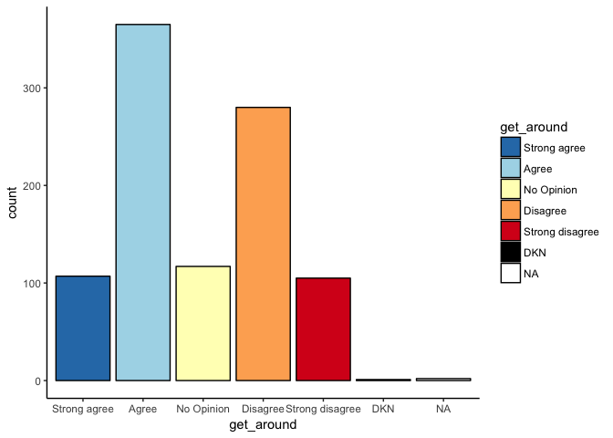

# Smart Cities YYT Baseline Survey Results

Results are from 977 participants who completed the online survey. Once complete we will post the analysis of the final results. We will flag invalid results or changes in sample size below each figure or description. 


#### Question 1

## I can easily get around St. John's


```r
plot(q1_plot)
```

<!-- -->

There are distinct differences between whether people feel they can easily get around St. John's. While the majority of people feel they can easily get around St. John's, there is a large number of people who disagree or strongly disagree and feel they cannot easily get around St. John's. 

#### Question 2

## I feel safe while getting around in St. John's


```r
plot(q2_plot)
```

<!-- -->

The majority of people feel that they can safely get around St. John's. Nearly 300 people of the 974 who answered the question disagree and do not feel safe getting around St. John's. 

#### Question 3

## I can use my preferred mode of transportation (for example car, bus, human-powered transportation or other) in St. John’s


```r
plot(q3_plot)
```

<!-- -->

The majority of people think that they can use their preferred mode of transportation in St. John's. Similar to the previous questions the distribution shows that there is not consistent agreement with 306 of the 974 who answered with disagreeing or strongly disagreeing. 

#### Question 4

## St. John’s is currently designed for accessible transportation


```r
plot(q4_plot)
```

<!-- -->

The vast majority of people either disagree or stronly disagree that St. John's is designed for accessible transportation. This suggests that there is a strong concensus to improve accesible design in St. John's. 
